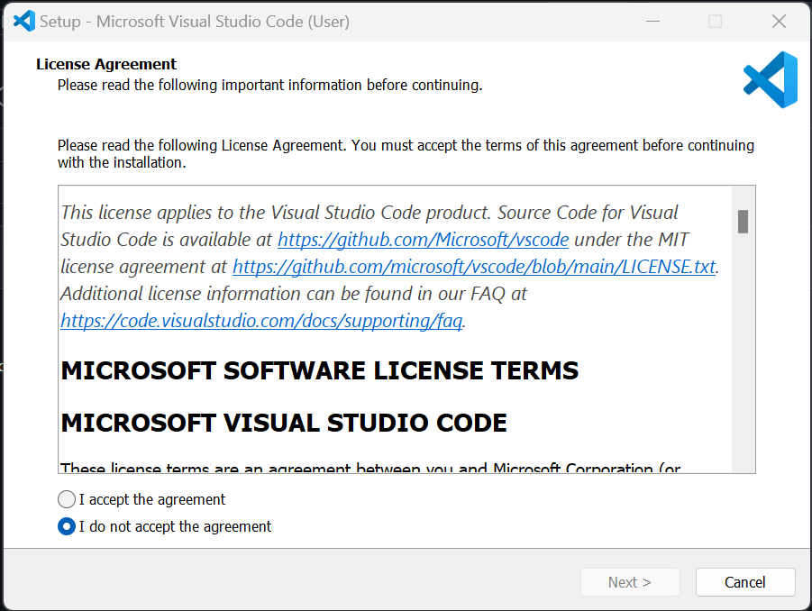
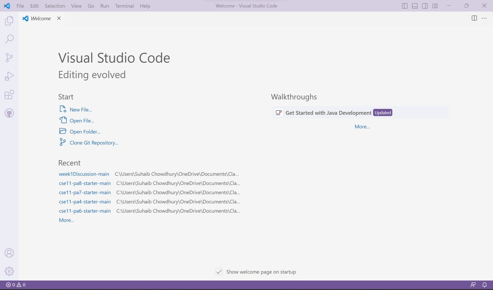
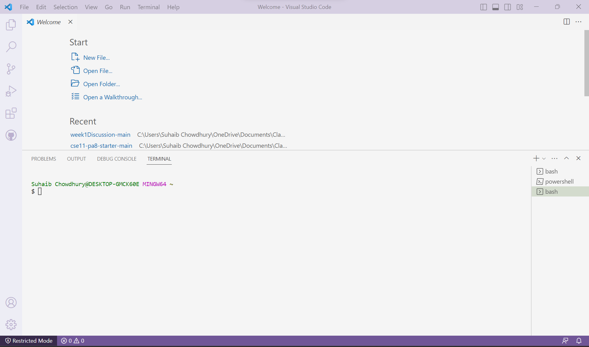
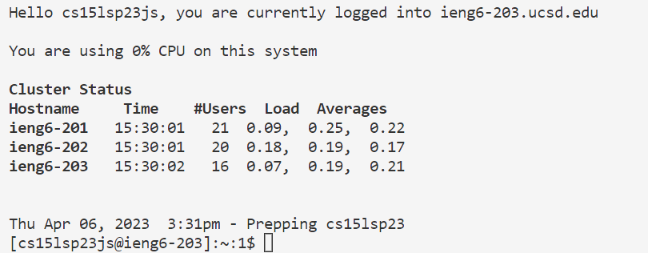
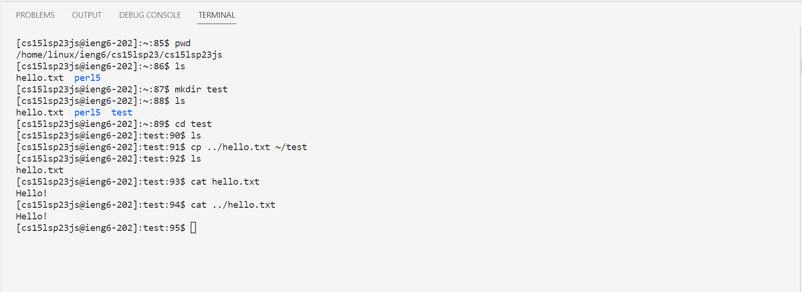

# Lab Report 1
## Step 1: Intsalling VS Code
1. Go to (https://code.visualstudio.com/) and download the VSCode installer for your desired operating system.
2. Run the installer and folow the onscreen instructions.

3. Once you are done, you should have something the looks like this:


## Step 2: Remotely Connecting
1. Intall git using this link: )https://gitforwindows.org/).
2. Open VSCode and open a new terminal by using the shortcut `Ctrl` + `````.
3. Open the command pallete using `Ctrl` + `Shift` + `P`. Then search for "Temrinal: Select Default Profile" and select "Git Bash".
4. Press `+` on the terminal to open a new Bash terminal. You should have something like this:

5. Once you are in the terminal, type the command `$ ssh cs15lsp23XX@ieng6.ucsd.edu` (but replace `XX` with whaterver the lettes are in your account) and run it.
6. You will then be promted to enter your password. Enter it (nothing will show up on the terminal) and press enter. The terminal should now look something like this:


## Step 3: Running Commands
You can now run commands on the remote machine. You can try out the following commands on both your own machine and the remote machine:
- `pwd`: print the current working directory to the terminal
- `cd`: change the current working directory
- `ls`: list all files and subdirectories within the current directory
- `mkdir`: creates a new directory
- `cp`: copies a speific file to another location
- `cat`: prints the contents of the specified files to the terminal

Here are some examples:

