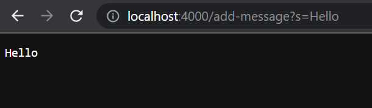
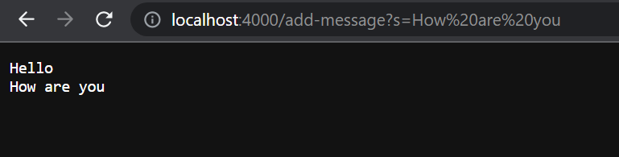
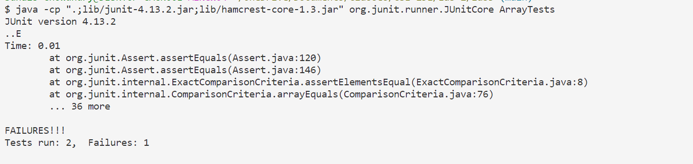

# Lab Report 2
## Part 1
StringServer.java:
```
import java.io.IOException;
import java.net.URI;

class StringHandler implements URLHandler {
    String runningString = "";

    public String handleRequest(URI url) {
       if (url.getPath().contains("/add-message")){
        String[] parameters = url.getQuery().split("=");
        if (parameters[0].equals("s")){
            runningString = runningString.concat(parameters[1]);
            runningString = runningString.concat("\n");
            return runningString;
        }
       }
       return "404 Not Found!";
    }
}

class StringServer {
    public static void main(String[] args) throws IOException {
        if(args.length == 0){
            System.out.println("Missing port number! Try any number between 1024 to 49151");
            return;
        }

        int port = Integer.parseInt(args[0]);
        Server.start(port, new StringHandler());
    }
}

```

Screenshot 1:


1. `StringHandler.handleRequest()` is called.
2. The relevant argument is `url`, and the relevant feilds are `runningString=""`, `parameters[0]="s"` and `parameters[1]="Hello"`.
3. `runningString` changes to `Hello\n`. 

Screenshot 2:


1. `StringHandler.handleRequest()` is called.
2. The relevant argument is `url`, and the relevant feilds are `runningString="Hello\n"`, `parameters[0]="s"` and `parameters[1]="How are you"`.
3. `runningString` changes to `Hello\nHow are you\n`. 

## Part 2
Faling Test:
```
  @Test
  public void testReverseInPlaceFailure(){
    int[] input1 = {1,2,3,4,5};
    ArrayExamples.reverseInPlace(input1);
    assertArrayEquals(new int[]{5,4,3,2,1 }, input1);
  }
```

Paasing Test:
```
  @Test
  public void testReverseInPlacePass(){
    int[] input1 = {0,0,0,0,0};
    ArrayExamples.reverseInPlace(input1);
    assertArrayEquals(new int[]{0,0,0,0,0}, input1);
  }
```
Symptoms:



Bugged Code:
```
  static void reverseInPlace(int[] arr) {
    for(int i = 0; i < arr.length; i += 1) {
      arr[i] = arr[arr.length - i - 1];
    }
  }
```
Fixed Code:
```
 static void reverseInPlace(int[] arr) {
    int[] original = new int[arr.length]; 
    for(int i = 0; i < arr.length; i += 1) {
      original[i] = arr[i];
    }
    for(int i = 0; i < arr.length; i += 1) {
      arr[i] = original[arr.length - i - 1];
    }
  }
```
The old code modified the old array. As the `for` loop iterated, the first half of `arr` was reversed correctly. However, the second copies from the first half of `arr`, which is an already portion of the original array. This causes the second half of `arr` to be a reserved version of the first half. Adding a new array that is a copy of the original state of the array prevnts this from happening.

## Part 3

I learned about the parts of a URL and how to use them. I learned how the path can be used to porgram functionalit. I also learned that the query can be used as a way to pass infroamtion into the program like a variable.
