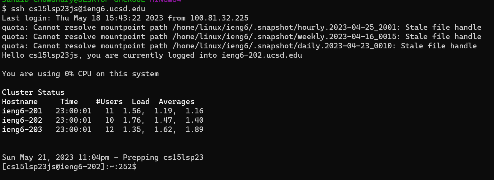
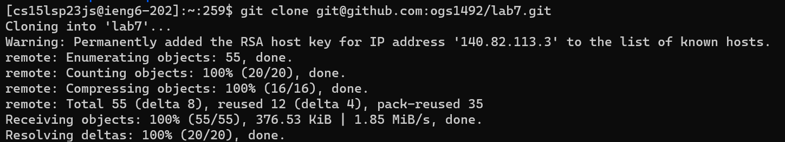
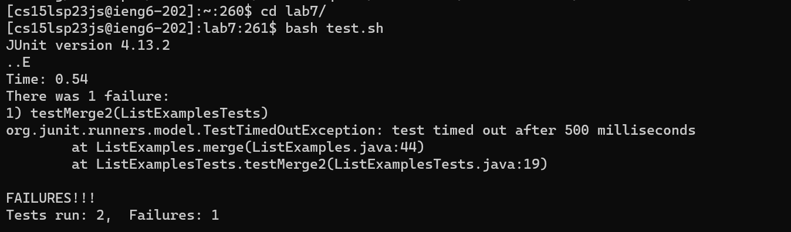
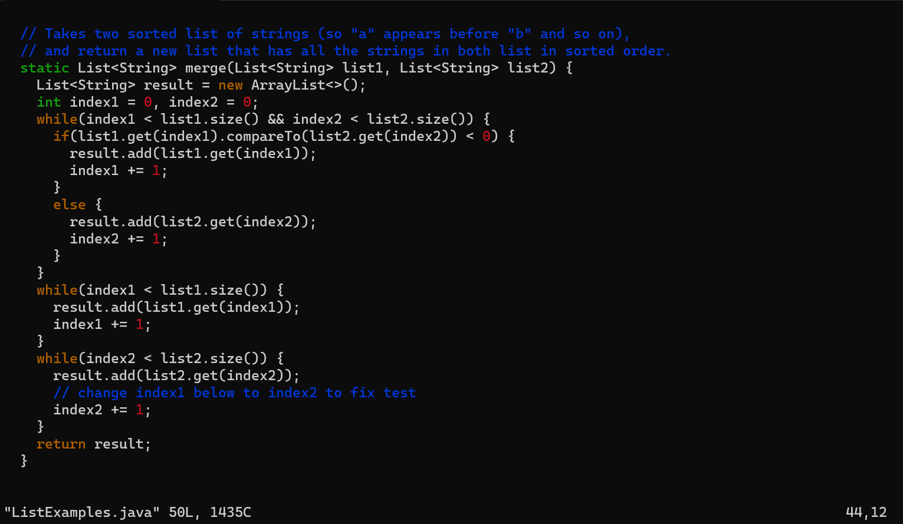
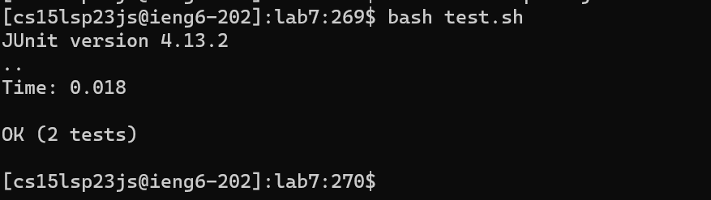
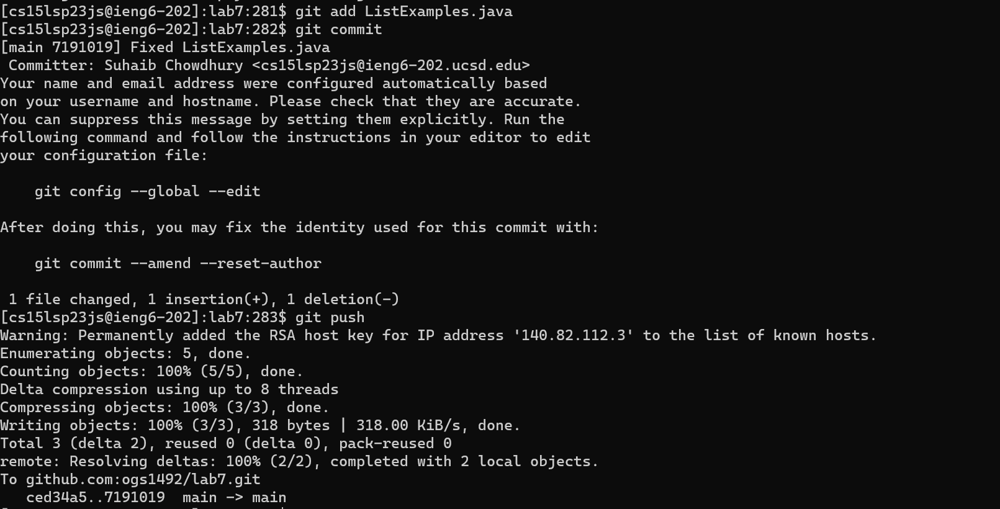

# Lab Report 4

## Step 4:

Keys Pressed: `<ssh cs15lsp23js@ieng6.ucsd.edu<enter>`

Since I started with a fresh terminal session, I had to type the command manually. Since I had set up the SSH keys, I did not need to enter my password and running the command was able to immediately connect me to the remote pc.

## Step 5:

Keys Pressed: `git clone <ctrl>v<enter>` 

I copied the git SSH link from GitHub and pasted it into the command line. This command clones the repository using the git SSH link.

## Step 6:

Keys Pressed: `cd l<tab><enter>bash t<tab><enter>`

Since `lab7` was the only directory in `~` that starts with `l`, so tab-completion was able to take me to the directory. The same thing happened with the second command. The only file that starts with `t` is `test.sh`. This command runs the bash script without requiring me to type the `javac` and `java` commands.

## Step 7:

Keys Pressed: `vim L<tab>.<tab><enter>r2`

For the first command, tab-completion auto completed `ListExamples` and the second tab-completion filled in `java`. Since my cursor was already at the location to make the edit, all I had to do was type in `r2` in command mode. This replaced the `1` character with `2` right after the cursor.

## Step 8:

Keys Pressed: `:wq<enter><up><up><enter>`

The first few keystrokes exited vim and saved my changes. After thet, I moved up teo lines in the command history where the `bash test.sh` command was and entered it. 

## Step 9:

Keys Pressed: `git add L<tab>.j<tab><enter><enter>ifixed ListExamples.java<esc>:wq<enter>git push`

I typed the `git add` and autocompleted the file. Vim was opened up. I typed in the commit message and exited while saving. I then pushed the commit to GitHub.

