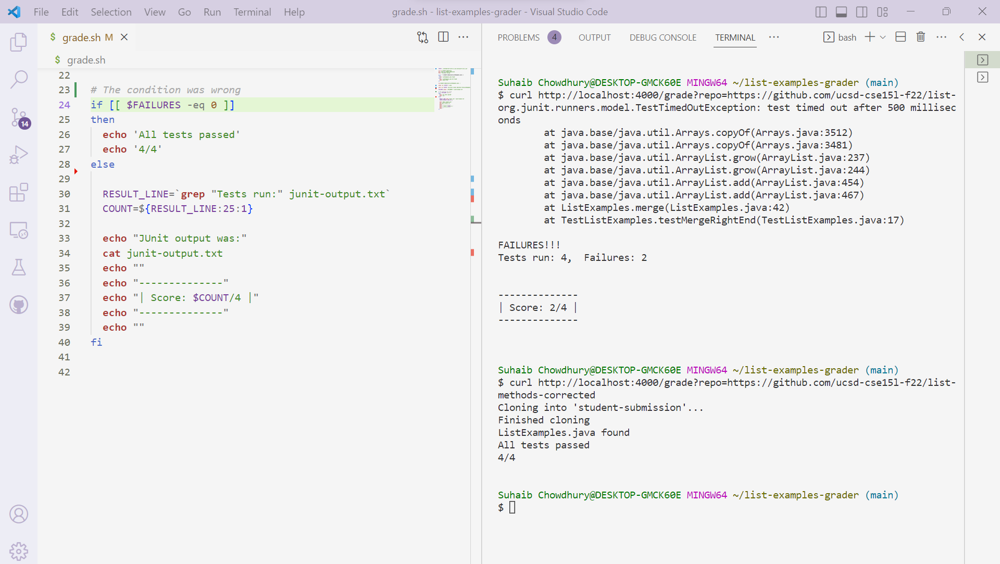
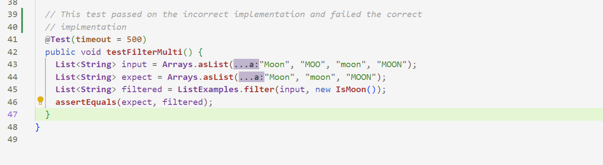

# Lab Report 5
## Part 1
### Initial Student Comment:
**What environment are you using (computer, operating system, web browser, terminal/editor, and so on)?**

I am using visual studio code on a windows computer. 

**Detail the symptom you're seeing. Be specific; include both what you're seeing and what you expected to see instead. Screenshots are great, copy-pasted terminal output is also great. Avoid saying “it doesn't work”.**

When I try running GradeServer using the default repo (https://github.com/ucsd-cse15l-f22/list-methods-lab3), the output given is the ouput for when all tests pass, even though it should a different output for when the test fail.
When I run it with the complile error repo (https://github.com/ucsd-cse15l-f22/list-methods-compile-error), the output displays the error and prinys that all tests pass, even though it should not.
Using the correct repo (https://github.com/ucsd-cse15l-f22/list-methods-corrected) works fine.


```
$ curl http://localhost:4000/grade?repo=https://github.com/ucsd-cse15l-f22/list-methods-lab3
Cloning into 'student-submission'...
Finished cloning
ListExamples.java found
All tests passed
4/4
```

```
$ curl http://localhost:4000/grade?repo=https://github.com/ucsd-cse15l-f22/list-methods-corrected
Cloning into 'student-submission'...
Finished cloning
ListExamples.java found
All tests passed
4/4
```

```
$ curl http://localhost:4000/grade?repo=https://github.com/ucsd-cse15l-f22/list-methods-compile-error
Cloning into 'student-submission'...
Finished cloning
ListExamples.java found
ListExamples.java:15: error: ';' expected
        result.add(0, s)
                        ^
1 error
All tests passed
4/4
```

**Detail the failure-inducing input and context. That might mean any or all of the command you're running, a test case, command-line arguments, working directory, even the last few commands you ran. Do your best to provide as much context as you can.**

Commands Ran:
```
$ java GradeServer 4000
$ curl http://localhost:4000/grade?repo=https://github.com/ucsd-cse15l-f22/list-methods-lab3
$ curl http://localhost:4000/grade?repo=https://github.com/ucsd-cse15l-f22/list-methods-corrected
$ curl http://localhost:4000/grade?repo=https://github.com/ucsd-cse15l-f22/list-methods-compile-error
```

All tests passed output:
```
echo 'All tests passed'
echo '4/4'
```


Tests fail Output:
```
RESULT_LINE=`grep "Tests run:" junit-output.txt`
  COUNT=${RESULT_LINE:25:1}
  echo "JUnit output was:"
  cat junit-output.txt
  echo ""
  echo "--------------"
  echo "| Score: $COUNT/4 |"
  echo "--------------"
  echo ""
```

Tests:
```
  @Test(timeout = 500)
  public void testMergeRightEnd() {
    List<String> left = Arrays.asList("a", "b", "c");
    List<String> right = Arrays.asList("a", "d");
    List<String> merged = ListExamples.merge(left, right);
    List<String> expected = Arrays.asList("a", "a", "b", "c", "d");
    assertEquals(expected, merged);
  }

  @Test(timeout = 500)
  public void testMergeLeftEnd() {
    List<String> left = Arrays.asList("a", "b", "z");
    List<String> right = Arrays.asList("a", "d");
    List<String> merged = ListExamples.merge(left, right);
    List<String> expected = Arrays.asList("a", "a", "b", "d", "z");
    assertEquals(expected, merged);
  }

  @Test(timeout = 500)
  public void testFilterSingle() {
    List<String> input = Arrays.asList("Moon", "MOO", "moo");
    List<String> expect = Arrays.asList("Moon");
    List<String> filtered = ListExamples.filter(input, new IsMoon());
    assertEquals(expect, filtered);
  }

  @Test(timeout = 500)
  public void testFilterMulti() {
    List<String> input = Arrays.asList("Moon", "MOO", "moon", "MOON");
    List<String> expect = Arrays.asList("MOON", "moon", "Moon");
    List<String> filtered = ListExamples.filter(input, new IsMoon());
    assertEquals(expect, filtered);
  }
```

### TA Response:

I need more information to be able to help you better. Are you sure that your logic for determining what to output is correct? Why does the compiler error pass and print out the error but not the incorrect implementation? 
Also, make sure that your tests are rigourous enough. You might be having some false positives.

### Student Fix





There were two bugs: The condition in grade.sh should be `-eq` instead of `-ne`. The expected value of `testFilterMulti()` should be `("Moon", "moon", "MOON")`

### Fixing the Bug
The files are the same as https://github.com/ucsd-cse15l-f22/list-examples-grader/blob/main/grade.sh.
The files are 

grade.sh:
```
# If you are using a UNIX system, replace the semicolons with colons.
CPATH='.;lib/hamcrest-core-1.3.jar;lib/junit-4.13.2.jar'

rm -rf student-submission
git clone $1 student-submission
echo 'Finished cloning'

if [[ -f student-submission/ListExamples.java ]]
then
  echo 'ListExamples.java found'
else
  echo 'ListExamples.java not found'
  echo 'Score: 0/4'
fi

cp student-submission/ListExamples.java ./

# If using a UNIX machine, remove the quotes are $CPATH
javac -cp "$CPATH" *.java
java -cp "$CPATH" org.junit.runner.JUnitCore TestListExamples > junit-output.txt

FAILURES=`grep -c FAILURES!!! junit-output.txt`

if [[ $FAILURES -ne 0 ]]
then
  echo 'All tests passed'
  echo '4/4'
else
  RESULT_LINE=`grep "Tests run:" junit-output.txt`
  COUNT=${RESULT_LINE:25:1}

  echo "JUnit output was:"
  cat junit-output.txt
  echo ""
  echo "--------------"
  echo "| Score: $COUNT/4 |"
  echo "--------------"
  echo ""
fi
```

TestListExamples.java
```
import static org.junit.Assert.*;
import org.junit.*;
import java.util.Arrays;
import java.util.List;

class IsMoon implements StringChecker {
  public boolean checkString(String s) {
    return s.equalsIgnoreCase("moon");
  }
}

public class TestListExamples {
  @Test(timeout = 500)
  public void testMergeRightEnd() {
    List<String> left = Arrays.asList("a", "b", "c");
    List<String> right = Arrays.asList("a", "d");
    List<String> merged = ListExamples.merge(left, right);
    List<String> expected = Arrays.asList("a", "a", "b", "c", "d");
    assertEquals(expected, merged);
  }

  @Test(timeout = 500)
  public void testMergeLeftEnd() {
    List<String> left = Arrays.asList("a", "b", "z");
    List<String> right = Arrays.asList("a", "d");
    List<String> merged = ListExamples.merge(left, right);
    List<String> expected = Arrays.asList("a", "a", "b", "d", "z");
    assertEquals(expected, merged);
  }

  @Test(timeout = 500)
  public void testFilterSingle() {
    List<String> input = Arrays.asList("Moon", "MOO", "moo");
    List<String> expect = Arrays.asList("Moon");
    List<String> filtered = ListExamples.filter(input, new IsMoon());
    assertEquals(expect, filtered);
  }

  @Test(timeout = 500)
  public void testFilterMulti() {
    List<String> input = Arrays.asList("Moon", "MOO", "moon", "MOON");
    List<String> expect = Arrays.asList("MOON", "moon", "Moon");
    List<String> filtered = ListExamples.filter(input, new IsMoon());
    assertEquals(expect, filtered);
  }
}

```

The commands are (assuming the working directory is `list-exaples-grader`:
```
$ javac *.java
$ java GradeServer 4000
$ curl http://localhost:4000/grade?repo=https://github.com/ucsd-cse15l-f22/list-methods-lab3
$ curl http://localhost:4000/grade?repo=https://github.com/ucsd-cse15l-f22/list-methods-corrected
$ curl http://localhost:4000/grade?repo=https://github.com/ucsd-cse15l-f22/list-methods-compile-error
```

To fix the bugs:
On line 26 of `grade.sh`, replace `-ne` with `-eq`.
On line 42 of `TestListExamples.java `, replace `("Moon", "moon", "MOON")` with `("Moon", "moon", "Moon")`

## Part 2

The coolest thing I learned in the last few weeks was ssh keys. I have used ssh keys to connect to a virtual machine before, but I used them in a different way. I had to give the path of the private key as a command line argument of the `ssh` command. I never knew that you can use them to not have to use a password when logging in. The github keys were also useful, since I did not need to manually log in every time I wanted to use GitHub on ieng6. 

